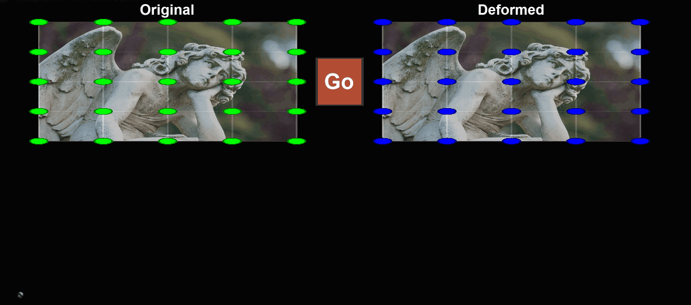

A little test following the ideas in [Meshless Deformation Based On Shape Matching](https://graphics.stanford.edu/courses/cs468-05-fall/Papers/p471-muller.pdf).

It's a bit of a mess at the moment, as I got hit by the bug described in these comments:

```
  -- cf. https://github.com/danielflower/MeshlessDeformations/blob/master/MeshlessDeformations/DeformableObject.cpp#L127
  -- also section 3.1 of the accompanying "MeshlessDeformationsReport.pdf"
```

and thus the lingering debug `print`s and `WithIntegration` stuff. (Does indeed seem stable now, though.)

More interesting might be to do spring-based handles like in the paper's video (found on [the author's publications page]( https://matthias-research.github.io/pages/publications/publications.html))
and drag it around, possibly for decent cloth or jelly mechanics.

Quadratic interpolation, clustering, and plasticity NYI.

---



[Web version](https://ggcrunchy.github.io/projects/deform/)

